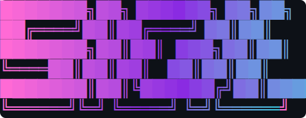
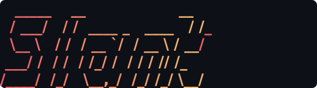
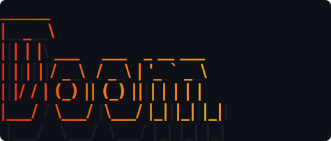
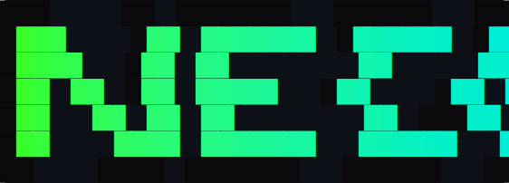
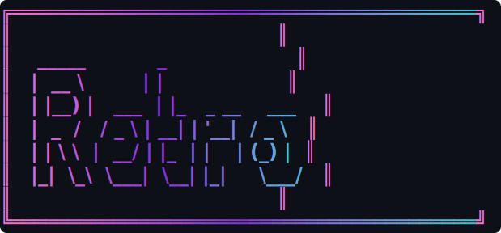
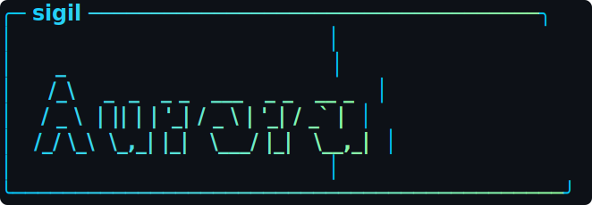
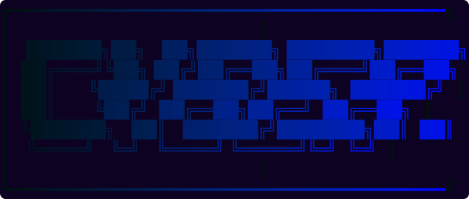

<p align="center">
  
</p>

<h1 align="center">sigil</h1>

<p align="center"><strong>Give your CLI a face.</strong> Modern gradient ASCII banners for your projects and command-line tools.</p>

`sigil` turns text into a FIGlet banner and paints it with a smooth, perceptually-uniform gradient (interpolated in [Oklab](https://bottosson.github.io/posts/oklab/), so blends stay vivid instead of passing through muddy middles). Use it as a splash for your own CLI's `--help`, a header in your README, or just to make your terminal a little more fun. All banners in this README were generated by `sigil -F svg`.

> A single self-contained binary with no runtime dependencies.

**Contents:** [Install](#install) · [Quick start](#quick-start) · [Usage](#usage) · [Embed in your own tool](#embed-in-your-own-tool) · [Config](#config) · [Development](#development)

## Install

```sh
# From source (this repo)
cargo install --path .

# Directly from git
cargo install --git https://github.com/moose25/sigil

# Prebuilt binaries: grab the archive for your platform from the Releases page,
# then move `sigil` onto your PATH.
```

Once published to crates.io: `cargo install sigil`.

## Quick start

```sh
sigil "My Project" --gradient sunset
sigil demo                     # see a showcase of fonts, gradients, and effects
```

## Gallery

A few of the combinations sigil can produce — every image below was generated
with `sigil … -F svg` (see the command under each):

<table>
  <tr>
    <td align="center"><br><sub><code>-f slant -g sunset</code></sub></td>
    <td align="center"><br><sub><code>-f doom -g fire --shadow</code></sub></td>
  </tr>
  <tr>
    <td align="center"><br><sub><code>-f ansiregular -g neon --outline</code></sub></td>
    <td align="center"><br><sub><code>-f big -g vaporwave -b double</code></sub></td>
  </tr>
  <tr>
    <td align="center"><br><sub><code>-f small -g aurora -b round --title sigil</code></sub></td>
    <td align="center"><br><sub><code>--theme cyberpunk</code></sub></td>
  </tr>
</table>

Run `sigil demo` to see the showcase live, or try an animation:

```sh
sigil "launch" -g fire --animate sweep
sigil "ready"  --animate type --fps 60
sigil "loop"   -g rainbow --animate scroll
```

## Usage

```sh
sigil "Hello" --gradient ocean --direction diagonal --align center
sigil "Ship it" --colors "#ff5f6d,#ffc371"   # custom gradient stops
sigil "Deploy" --font ansishadow             # pick a font
echo "From stdin" | sigil                     # or pipe the text in
sigil --art cat.txt -g rainbow                # colorize existing ASCII art
sigil "Launching" -g fire --animate sweep     # animated shimmer (TTY only)
sigil "Ready" --animate type --fps 60         # typewriter reveal
sigil "Angle" -g rainbow --angle 60 --cycle 2 # tilted, repeating palette
sigil "Boxed" -g ocean --border round         # frame it in a box
sigil "Deploy" --icon "🚀" -g fire            # a small icon beside the wordmark
sigil "Acme" --subtitle "ship faster" -f big  # a logo with a smaller tagline
sigil "Surprise" --random                      # random font + gradient (--seed N to repeat)
sigil --lines "deploy" "prod"                   # stack multiple banners in one frame
sigil "Neo" --theme cyberpunk                   # a curated font+gradient+border+bg bundle
sigil gradients                               # preview all presets
sigil fonts                                   # preview all fonts
sigil "plain" --no-color                      # respects NO_COLOR too
```

### Options

| Flag | Description | Default |
| ---- | ----------- | ------- |
| `-g, --gradient <name>` | Named preset (see `sigil gradients`) | `ocean` |
| `-c, --colors <hex,...>` | Custom gradient stops (optional `@pos`, e.g. `#000@0,#fff@0.8`) | — |
| `-d, --direction <dir>` | `horizontal` \| `vertical` \| `diagonal` \| `radial` \| `conic` | `horizontal` |
| `--angle <deg>` | Sweep angle in degrees (overrides `--direction`) | — |
| `--color-by <mode>` | `banner` \| `line` \| `char` (per-line / per-glyph coloring) | `banner` |
| `--interpolate <space>` | Blend space: `oklab` \| `rgb` \| `hsl` | `oklab` |
| `--reverse` | Flip the gradient direction | — |
| `--cycle <n>` | Repeat the palette N times across the banner | `1` |
| `-b, --border <style>` | `none` \| `round` \| `single` \| `double` \| `heavy` \| `ascii` | `none` |
| `-p, --padding <n>` | Interior padding inside the frame | `1` (with border) |
| `--pad-x <n>` / `--pad-y <n>` | Horizontal/vertical padding (override `--padding` per axis) | — |
| `--title <text>` | Caption embedded in the top border | — |
| `--border-color <hex>` | Solid frame color (default: share the gradient) | — |
| `--background <hex>` | Solid background fill behind the banner (alias `--bg`) | — |
| `--shadow` | Draw a drop shadow behind the glyphs | — |
| `--shadow-color <hex>` | Shadow color | dark gray |
| `--outline` | Draw an outline (halo) around the glyphs | — |
| `--outline-color <hex>` | Outline color | near-black |
| `-a, --align <align>` | `left` \| `center` \| `right` | `left` |
| `-f, --font <name>` | Font (see `sigil fonts`) | `standard` |
| `--icon <glyph>` | Prefix a small icon/emoji to the left of the banner | — |
| `--letter-spacing <n>` | Extra blank columns between glyphs (airier look) | — |
| `--subtitle <text>` | A smaller tagline stacked beneath the banner | — |
| `--subtitle-font <name>` | Font for the subtitle line | `small` |
| `--fit <cols>` | Auto-pick the boldest bundled font whose banner fits N columns (overrides `--font`) | — |
| `-w, --width <cols>` | Target width for alignment | terminal width |
| `--min-width <cols>` | Pad the banner box out to at least N columns (centered) | — |
| `-m, --margin <n>` | Blank lines above/below | `0` |
| `--margin-x <n>` | Left indent in columns (on top of alignment) | `0` |
| `-F, --format <fmt>` | `term` \| `ansi` \| `raw` \| `rust` \| `go` \| `python` \| `shell` | `term` |
| `-o, --out <file>` | Write to a file instead of stdout | — |
| `--animate <style>` | `none` \| `sweep` \| `type` \| `pulse` \| `scroll` (terminal only) | `none` |
| `--fps <n>` | Animation speed, 1–120 | `30` |
| `-l, --lines` | Stack each input line/argument as its own banner | — |
| `--random` | Random font + gradient for anything unset | — |
| `--seed <n>` | Seed for `--random` (reproducible) | — |
| `--copy` | Also copy the output to the system clipboard | — |
| `--no-color` | Disable color | — |

### Gradients

`sunset`, `ocean`, `fire`, `mint`, `grape`, `cyberpunk`, `gold`, `ice`, `vaporwave`, `rainbow`, `matrix`, `flamingo`, `mono`, `aurora`, `lava`, `neon`, `pastel`, `dusk`, `berry`, `steel`, `forest` — or roll your own with `--colors`.

### Themes

Curated bundles of font + gradient + border + background (+ shadow/outline): `cyberpunk`, `retro`, `terminal`, `fire`, `ocean`, `gold`, `mono`, `sunset`, `forest`, `candy`, `midnight`. Apply one with `--theme <name>` (individual flags still override), define your own under `[themes.<name>]` in config, and list them with `sigil themes`.

### Fonts

`standard`, `ansishadow`, `slant`, `big`, `small`, `doom`, `bloody`, `3d`, `ansiregular`, `ghost` (with aliases like `shadow`, `italic`, `mini`, `ansi`). Run `sigil fonts` for a live preview. Bundled fonts are embedded in the binary — see [src/fonts/NOTICE.md](src/fonts/NOTICE.md) for attribution.

**Custom fonts:** pass a path to any FIGlet font — `sigil "Hi" -f ./cool.flf` — or drop `.flf` files in `~/.config/sigil/fonts/` and use them by name (`-f cool`). They show up in `sigil fonts` too. Code-tagged glyphs are trimmed automatically so most fonts "just work."

## Embed in your own tool

Generate a banner once and paste it into your project — a splash for `--help`, a startup logo, a script header. `--format` emits ready-to-use output:

```sh
sigil "Acme" -g sunset -F rust   > src/banner.rs   # pub const BANNER: &str = ...
sigil "Acme" -g sunset -F go     > banner.go        # const Banner = ...
sigil "Acme" -g sunset -F python > banner.py        # BANNER = ...
sigil "Acme" -g sunset -F shell  > banner.sh        # cat <<'…' heredoc that prints it
sigil "Acme" -g sunset -F ansi   > banner.ansi      # raw colored ANSI bytes
sigil "Acme" -g sunset -F svg    > banner.svg        # standalone SVG image
sigil "Acme" -g sunset -F html   > banner.html       # standalone HTML page
sigil "Acme" -g sunset -F png -o banner.png          # PNG raster image
sigil "Acme" -g sunset -F json   > banner.json       # structured grid + colors
sigil "Acme" -g sunset -F png --scale 3 -o big.png   # 3x-resolution PNG
```

`-F svg` produces a self-contained SVG (colored monospace grid on a dark
backdrop) — drop it straight into a README or docs. Add `--animate sweep` for an
**animated** SVG whose gradient shimmers in the browser (no gif tooling needed).
`-F png` writes a raster image (one color block per cell — crisp, font-free, and
best with block fonts like `ansishadow`/`ansiregular`).

The `rust`/`go`/`python` snippets define a `BANNER` constant (with a comment showing how to print it); `shell` is a runnable heredoc. Color is baked into every snippet format. Use `-o <file>` instead of a shell redirect if you prefer.

## Config

Set defaults so you don't repeat flags. sigil reads two optional files and merges them, then command-line flags override everything:

**Precedence:** CLI flag > `.sigil.toml` (project, current dir) > `~/.config/sigil/config.toml` (user) > built-in default.

```toml
# ~/.config/sigil/config.toml  or  ./.sigil.toml
gradient = "vaporwave"
font = "ansishadow"
align = "center"
border = "round"
# any of: colors, direction, angle, reverse, cycle, padding,
# border_color, margin, width, animate, fps, format

# Define your own named gradients and use them like built-ins (-g brand):
[gradients]
brand   = ["#0f2027", "#203a43", "#2c5364"]
sunset2 = ["#ff9966", "#ff5e62"]
```

Unknown keys are rejected so typos surface early. Your gradients show up in `sigil gradients`. Run `sigil init` to drop a commented starter config in place (`--print` to preview, `--force` to overwrite).

## Color support

`sigil` emits 24-bit truecolor when `COLORTERM` advertises it, falls back to the 256-color palette otherwise, and prints plain glyphs under `NO_COLOR` or `--no-color`.

## Shell completions & man page

```sh
sigil completions zsh  > ~/.zfunc/_sigil       # bash | zsh | fish | powershell | elvish
sigil man              > sigil.1               # roff man page
```

## Development

```sh
cargo build          # debug build
cargo test           # run the test suite
cargo fmt            # format
cargo clippy --all-targets -- -D warnings
cargo run -- "Hi"    # try it
```

Contributions welcome. The codebase is small and modular:

- `color` — sRGB/Oklab math and ANSI escapes
- `gradient` — presets, sampling, interpolation spaces
- `fonts` — bundled + custom FIGlet fonts
- `render` — layout, the cell grid, effects, and the SVG/HTML/PNG/JSON renderers
- `animate` — terminal animations
- `text` / `config` / `themes` / `export` — input folding, config, themes, formats

Ideas and open work are tracked in [issues](../../issues) and grouped by
milestone. See [CHANGELOG.md](CHANGELOG.md) for the feature history.

## License

[MIT](LICENSE) © Chris Williams. Bundled FIGlet fonts retain their original
permissive licenses — see [src/fonts/NOTICE.md](src/fonts/NOTICE.md).
